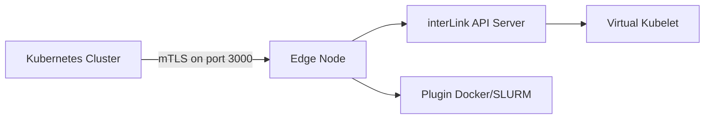

import ThemedImage from "@theme/ThemedImage";
import useBaseUrl from "@docusaurus/useBaseUrl";
import Tabs from "@theme/Tabs";
import TabItem from "@theme/TabItem";

# Quickstart: mTLS Setup in 10 Minutes

Get interLink running with mutual TLS (mTLS) authentication in under 10 minutes. This is the fastest way to try interLink without configuring an OIDC provider.

:::info Prerequisites

Before you begin, ensure you have:

- **Edge node**: A Linux machine (VM or bare metal) accessible from your Kubernetes cluster
- **Kubernetes cluster**: Any K8s cluster with `kubectl` configured and Helm 3.x installed
- **Docker or SLURM**: Either Docker Engine (for testing) or SLURM (for HPC) on the edge node
- **Tools**: `openssl`, `wget`, `jq`, `curl` installed on edge node
- **Network**: Edge node must be reachable from Kubernetes cluster on port 3000 (or custom)

:::

## Overview



This guide will:
1. Generate mTLS certificates (2 min)
2. Set up interLink API server on edge node (3 min)
3. Start a plugin (Docker or SLURM) (2 min)
4. Deploy Virtual Kubelet to Kubernetes (2 min)
5. Test with a sample pod (1 min)

---

## Step 1: Generate mTLS Certificates

Run these commands on your **edge node**:

```bash
# Create working directory
mkdir -p ~/interlink-certs && cd ~/interlink-certs

# Create server extension config with SANs
cat > server-ext.cnf <<EOF
authorityKeyIdentifier=keyid,issuer
basicConstraints=CA:FALSE
keyUsage = digitalSignature, keyEncipherment
extendedKeyUsage = serverAuth
subjectAltName = @alt_names

[alt_names]
DNS.1 = interlink-server
DNS.2 = localhost
IP.1 = YOUR_EDGE_NODE_IP
IP.2 = 127.0.0.1
EOF

# Replace YOUR_EDGE_NODE_IP with your actual edge node IP
sed -i "s/YOUR_EDGE_NODE_IP/$(hostname -I | awk '{print $1}')/g" server-ext.cnf

# Generate CA (Certificate Authority)
openssl genrsa -out ca-key.pem 4096

# Generate CA certificate
openssl req -new -x509 -days 365 -key ca-key.pem -sha256 -out ca.pem \
  -subj "/C=US/ST=CA/L=San Francisco/O=InterLink/CN=InterLink CA"

# Generate server private key
openssl genrsa -out server-key.pem 4096

# Generate server certificate signing request
openssl req -subj "/C=US/ST=CA/L=San Francisco/O=InterLink/CN=interlink-server" \
  -sha256 -new -key server-key.pem -out server.csr

# Generate server certificate signed by CA (with SANs)
openssl x509 -req -days 365 -sha256 -in server.csr -CA ca.pem -CAkey ca-key.pem \
  -out server-cert.pem -extfile server-ext.cnf

# Generate client private key
openssl genrsa -out client-key.pem 4096

# Generate client certificate signing request
openssl req -subj "/C=US/ST=CA/L=San Francisco/O=InterLink/CN=interlink-client" \
  -sha256 -new -key client-key.pem -out client.csr

# Generate client certificate signed by CA
openssl x509 -req -days 365 -sha256 -in client.csr -CA ca.pem -CAkey ca-key.pem \
  -out client-cert.pem -extensions v3_req

# Clean up
rm server.csr client.csr server-ext.cnf

# Verify certificates
ls -la *.pem
```

:::tip Subject Alternative Names (SANs)

The server certificate includes SANs for proper TLS validation:
- `DNS.1 = interlink-server` - Internal DNS name
- `DNS.2 = localhost` - Local access
- `IP.1 = YOUR_EDGE_NODE_IP` - **Must match your edge node's IP**
- `IP.2 = 127.0.0.1` - Localhost IP

If your edge node has multiple IPs or hostnames, add them to the `[alt_names]` section.

:::

:::tip

Save the `ca.pem`, `client-cert.pem`, and `client-key.pem` files - you'll need them for the Kubernetes cluster setup.

:::

---

## Step 2: Set Up interLink API Server

Still on the **edge node**:

```bash
# Create directory structure
mkdir -p $HOME/.interlink/{bin,config,certs,logs}

# Copy certificates
cp ~/interlink-certs/*.pem $HOME/.interlink/certs/

# Create configuration file
cat > $HOME/.interlink/config/InterLinkConfig.yaml << 'EOF'
InterlinkAddress: https://0.0.0.0
InterlinkPort: "3000"
SidecarURL: http://localhost
SidecarPort: "4000"
DataRootFolder: "/tmp/interlink"
VerboseLogging: true
ErrorsOnlyLogging: false

# mTLS Configuration
TLS:
  Enabled: true
  CertFile: "/home/YOUR_USERNAME/.interlink/certs/server-cert.pem"
  KeyFile: "/home/YOUR_USERNAME/.interlink/certs/server-key.pem"
  CACertFile: "/home/YOUR_USERNAME/.interlink/certs/ca.pem"
EOF

# Replace YOUR_USERNAME with your actual username
sed -i "s|/home/YOUR_USERNAME/|$HOME/|g" $HOME/.interlink/config/InterLinkConfig.yaml

# Download interLink binary
export VERSION=$(curl -s https://api.github.com/repos/interlink-hq/interlink/releases/latest | jq -r .name)
wget -O $HOME/.interlink/bin/interlink \
  https://github.com/interlink-hq/interLink/releases/download/$VERSION/interlink_Linux_x86_64
chmod +x $HOME/.interlink/bin/interlink

# Start interLink API server
export INTERLINKCONFIGPATH=$HOME/.interlink/config/InterLinkConfig.yaml
$HOME/.interlink/bin/interlink &> $HOME/.interlink/logs/interlink.log &
echo $! > $HOME/.interlink/interlink.pid

# Verify it's running
sleep 2
tail -n 20 $HOME/.interlink/logs/interlink.log
```

You should see: `"mTLS enabled - requiring client certificates"`

---

## Step 3: Start a Plugin

Choose **one** plugin based on your edge node setup:

<Tabs groupId="plugin-type">
  <TabItem value="docker" label="Docker Plugin" default>

:::info Requirements

- Docker Engine installed and running
- User must be in `docker` group

:::

```bash
# Create plugin configuration
cat > $HOME/.interlink/config/plugin-config.yaml << EOF
Socket: "unix://$HOME/.interlink/.plugin.sock"
InterlinkPort: "0"
SidecarPort: "4000"
DataRootFolder: "$HOME/.interlink/jobs/"
BashPath: /bin/bash
VerboseLogging: false
ErrorsOnlyLogging: false
EOF

# Download Docker plugin
export PLUGIN_VERSION=$(curl -s https://api.github.com/repos/interlink-hq/interlink-docker-plugin/releases/latest | jq -r .name)
wget -O $HOME/.interlink/bin/plugin \
  https://github.com/interlink-hq/interlink-docker-plugin/releases/download/${PLUGIN_VERSION}/docker-plugin_Linux_x86_64
chmod +x $HOME/.interlink/bin/plugin

# Start plugin
export INTERLINKCONFIGPATH=$HOME/.interlink/config/plugin-config.yaml
$HOME/.interlink/bin/plugin &> $HOME/.interlink/logs/plugin.log &
echo $! > $HOME/.interlink/plugin.pid

# Verify
sleep 2
tail -n 10 $HOME/.interlink/logs/plugin.log
```

  </TabItem>
  <TabItem value="slurm" label="SLURM Plugin">

:::info Requirements

- SLURM batch system configured
- Singularity/Apptainer installed
- Shared filesystem with compute nodes

:::

```bash
# Create plugin configuration
cat > $HOME/.interlink/config/plugin-config.yaml << EOF
Socket: "unix://$HOME/.interlink/.plugin.sock"
InterlinkPort: "0"
SidecarPort: "4000"
DataRootFolder: "$HOME/.interlink/jobs/"
BashPath: /bin/bash
VerboseLogging: false
ErrorsOnlyLogging: false
SbatchPath: "/usr/bin/sbatch"
ScancelPath: "/usr/bin/scancel"
SqueuePath: "/usr/bin/squeue"
SingularityPrefix: ""
EOF

# Download SLURM plugin
export PLUGIN_VERSION=$(curl -s https://api.github.com/repos/interlink-hq/interlink-slurm-plugin/releases/latest | jq -r .name)
wget -O $HOME/.interlink/bin/plugin \
  https://github.com/interlink-hq/interlink-slurm-plugin/releases/download/${PLUGIN_VERSION}/interlink-sidecar-slurm_Linux_x86_64
chmod +x $HOME/.interlink/bin/plugin

# Start plugin
export SLURMCONFIGPATH=$HOME/.interlink/config/plugin-config.yaml
$HOME/.interlink/bin/plugin &> $HOME/.interlink/logs/plugin.log &
echo $! > $HOME/.interlink/plugin.pid

# Verify
sleep 2
tail -n 10 $HOME/.interlink/logs/plugin.log
```

  </TabItem>
</Tabs>

### Test interLink Health

```bash
curl -v --unix-socket ${HOME}/.interlink/.interlink.sock http://unix/pinglink
```

Expected response: `{"status":"ok"}` or similar success message.

---

## Step 4: Deploy to Kubernetes Cluster

Now switch to your **Kubernetes cluster** (your local machine with `kubectl`):

### 4.1 Create Certificate Secret

```bash
# Create namespace
kubectl create namespace interlink

# Copy certificates from edge node to your local machine
# (Use scp, rsync, or secure copy from Step 1)
# You need: ca.pem, client-cert.pem, client-key.pem

# Create secret (adjust paths to where you copied the certs)
kubectl create secret generic my-node-tls-certs \
  --from-file=ca.crt=/path/to/ca.pem \
  --from-file=tls.crt=/path/to/client-cert.pem \
  --from-file=tls.key=/path/to/client-key.pem \
  -n interlink
```

### 4.2 Create Helm Values File

```bash
# Create values file for mTLS
cat > interlink-mtls-values.yaml << 'EOF'
nodeName: "my-node"

virtualNode:
  resources:
    CPUs: 8
    memGiB: 49
    pods: 100
  HTTP:
    insecure: false
  kubeletHTTP:
    insecure: false

interlink:
  enabled: false
  address: https://YOUR_EDGE_NODE_IP
  port: 3000
  tls:
    enabled: true
    certFile: "/etc/vk/certs/tls.crt"
    keyFile: "/etc/vk/certs/tls.key"
    caCertFile: "/etc/vk/certs/ca.crt"
EOF

# Replace YOUR_EDGE_NODE_IP with the actual IP or hostname of your edge node
# This IP must be reachable from your Kubernetes cluster
sed -i "s/YOUR_EDGE_NODE_IP/YOUR_ACTUAL_EDGE_NODE_IP/g" interlink-mtls-values.yaml
```

### 4.3 Deploy with Helm

```bash
# Get latest chart version
export INTERLINK_CHART_VERSION=$(curl -s https://api.github.com/repos/interlink-hq/interlink-helm-chart/releases/latest | jq -r .tag_name | sed 's/interlink-//')

# Deploy
helm upgrade --install \
  --create-namespace \
  -n interlink \
  my-node \
  oci://ghcr.io/interlink-hq/interlink-helm-chart/interlink \
  --version $INTERLINK_CHART_VERSION \
  --values interlink-mtls-values.yaml
```

---

## Step 5: Verify and Test

### Check Virtual Node Status

```bash
# Wait for node to be ready (may take 30-60 seconds)
kubectl get nodes -w

# You should see:
# NAME       STATUS   ROLES    AGE   VERSION
# my-node    Ready    <none>   60s   v1.27.0
```

Press `Ctrl+C` to stop watching.

### Deploy a Test Pod

```bash
kubectl apply -f - <<EOF
apiVersion: v1
kind: Pod
metadata:
  name: quickstart-test
spec:
  nodeSelector:
    kubernetes.io/hostname: my-node
  tolerations:
    - key: virtual-node.interlink/no-schedule
      operator: Exists
  containers:
  - name: test
    image: busybox:latest
    command: ["sleep", "3600"]
EOF
```

### Check Pod Status

```bash
# Watch pod creation
kubectl get pod quickstart-test -w

# Should transition: Pending -> ContainerCreating -> Running
```

### Test Logs (Important!)

:::warning CSR Approval Required

If `kubectl logs` fails, you need to approve the Certificate Signing Request (CSR):

```bash
# Check for pending CSRs
kubectl get csr

# Approve the CSR (replace csr-xxxxx with actual name)
kubectl certificate approve csr-xxxxx

# Wait 10 seconds, then retry logs
```

:::

```bash
# Test log retrieval
kubectl logs quickstart-test

# Should return empty output (container is sleeping)
```

### Test on Edge Node

SSH to your **edge node** and verify the container/job was created:

<Tabs groupId="plugin-type">
  <TabItem value="docker" label="Docker Plugin">

```bash
# List containers created by interLink
docker ps --filter "name=quickstart-test"

# Or check all containers
docker ps -a | grep test
```

  </TabItem>
  <TabItem value="slurm" label="SLURM Plugin">

```bash
# Check SLURM jobs
squeue -u $USER

# Check job files
ls -la $HOME/.interlink/jobs/
```

  </TabItem>
</Tabs>

---

## Cleanup

To remove the setup:

```bash
# From Kubernetes cluster
kubectl delete pod quickstart-test
helm uninstall my-node -n interlink
kubectl delete namespace interlink

# From edge node
kill $(cat $HOME/.interlink/plugin.pid) 2>/dev/null
kill $(cat $HOME/.interlink/interlink.pid) 2>/dev/null
rm -rf $HOME/.interlink
rm -rf ~/interlink-certs
```

---

## Troubleshooting

### Node Not Ready

```bash
# Check Virtual Kubelet pod logs
kubectl logs -n interlink -l app=virtual-kubelet

# Common issues:
# - Network connectivity to edge node
# - Certificate mismatch
# - Wrong edge node IP in Helm values
```

### Certificate Errors

```bash
# Verify certificate chain on edge node
openssl verify -CAfile $HOME/.interlink/certs/ca.pem \
  $HOME/.interlink/certs/server-cert.pem

# Test mTLS connection from Kubernetes node
curl -v --cacert ca.pem \
     --cert client-cert.pem \
     --key client-key.pem \
     https://YOUR_EDGE_NODE_IP:3000/pinglink
```

### Plugin Not Responding

```bash
# Check plugin logs
tail -f $HOME/.interlink/logs/plugin.log

# Restart plugin
kill $(cat $HOME/.interlink/plugin.pid)
export INTERLINKCONFIGPATH=$HOME/.interlink/config/plugin-config.yaml
$HOME/.interlink/bin/plugin &> $HOME/.interlink/logs/plugin.log &
echo $! > $HOME/.interlink/plugin.pid
```

### Pod Stuck in Pending

```bash
# Check pod events
kubectl describe pod quickstart-test

# Check if node is actually ready
kubectl get nodes

# Verify tolerations and nodeSelector match
kubectl get node my-node -o yaml | grep -A 10 "labels"
```

---

## Next Steps

Congratulations! You now have a working interLink setup with mTLS authentication.

**What to explore next:**

1. **[Deploy Real Workloads](./cookbook/1-edge)** - Try running actual applications
2. **[Plugin Development](./guides/02-develop-a-plugin)** - Create custom plugins
3. **[Production Deployment](./guides/08-systemd-deployment)** - Set up systemd services
4. **[Monitoring Setup](./guides/05-monitoring)** - Add Grafana/Tempo observability
5. **[Security Hardening](#)** - Deep dive into mTLS (coming soon)

**Need Help?**

- 📖 [Full Documentation](./intro.mdx)
- 💬 [Join Slack](https://join.slack.com/t/intertwin/shared_invite/zt-2cs67h9wz-2DFQ6EiSQGS1vlbbbJHctA)
- 🐛 [GitHub Issues](https://github.com/interlink-hq/interLink/issues)
- 📋 [API Reference](./guides/03-api-reference.mdx)

---

## Architecture Reference

```
+---------------------------+     mTLS (port 3000)     +---------------------------+
|   Kubernetes Cluster    | -------------------------> |      Edge Node            |
|                         |                            |                           |
|  +------------------+   |                            |  +--------------------+   |
|  | Virtual Kubelet  |   |                            |  | interLink API      |   |
|  | (Helm deployed)  |   |                            |  | (mTLS enabled)     |   |
|  +--------+---------+   |                            |  +---------+----------+   |
|           |             |                            |            |              |
|           |             |                            |            | localhost    |
|           |             |                            |            v              |
|           |             |                            |  +--------------------+   |
|           |             |                            |  | Plugin             |   |
|           |             |                            |  | (Docker/SLURM)     |   |
|           |             |                            |  +--------------------+   |
+---------------------------+                            +---------------------------+
```

**Security Flow:**
1. Virtual Kubelet presents client certificate
2. interLink API validates against CA
3. interLink API presents server certificate
4. Virtual Kubelet validates against CA
5. Encrypted communication established
6. Plugin calls happen over localhost
